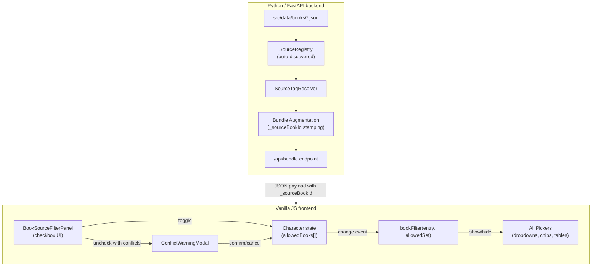

# Design Document: Book Source Filter

## Overview

The Book Source Filter adds per-sourcebook filtering to the Scion character creator. Players select which books are allowed, and the entire chargen wizard hides any game-data entry (boons, knacks, birthrights, equipment, purviews, paths, callings) that comes from a disallowed book.

The feature spans three layers:

1. **Backend** — A `SourceRegistry` that auto-discovers book metadata from `src/data/books/*.json` plus a deterministic `SourceTagResolver` that maps raw `source` strings and `sourceBook` slugs to canonical registry identifiers. Bundle assembly augments each entry with a pre-resolved `_sourceBookId` field.
2. **Character state** — The `Allowed_Books_Set` is an array of registry identifiers stored alongside other wizard state and included in JSON export/import.
3. **Frontend** — A collapsible checkbox panel, a JS filter function applied to every picker, and a conflict-detection modal for selections that would become orphaned.

The design keeps filtering entirely on the client side (set-membership check against `_sourceBookId`), so no additional API calls are needed when the user toggles a book.

## Architecture



## Components and Interfaces

### Backend Components

#### 1. SourceRegistry (`src/app/services/source_registry.py`)

Responsible for loading and exposing the canonical book list.

```python
@dataclass(frozen=True)
class BookEntry:
    slug: str              # e.g. "divine_arenas"
    title: str             # e.g. "Divine Arenas"
    pdf_patterns: list[str]  # e.g. ["7711-Divine_Arenas.pdf"]

class SourceRegistry:
    """Auto-discovered from src/data/books/*.json _meta blocks + hardcoded core books."""

    def __init__(self, books_dir: Path, core_books: list[BookEntry] | None = None) -> None: ...

    @property
    def entries(self) -> dict[str, BookEntry]:
        """slug → BookEntry, including core + discovered books."""
        ...

    def slug_for_pdf(self, pdf_filename: str) -> str | None: ...
    def slug_for_title_substring(self, text: str) -> str | None: ...
    def titles_sorted(self) -> list[tuple[str, str]]:
        """Return (slug, title) pairs sorted alphabetically by title."""
        ...
```

**Design decisions:**
- Core books (Origin, Hero, Pandora's Box, etc.) are hardcoded entries because they predate the `books/` directory convention and appear only in table fragments and `source` strings.
- Supplement books are auto-discovered by scanning `_meta.slug` and `_meta.title` from each JSON file in `src/data/books/`.
- Malformed files (missing `_meta`, invalid JSON) are logged with `warnings.warn()` and skipped.

#### 2. SourceTagResolver (`src/app/services/source_tag_resolver.py`)

Deterministic mapping from raw source strings to registry slugs.

```python
class SourceTagResolver:
    def __init__(self, registry: SourceRegistry) -> None: ...

    def resolve(self, source_tag: str) -> list[str]:
        """Return list of resolved registry slugs (one per semicolon segment).
        
        Resolution priority per segment:
          1. Exact slug match (case-insensitive)
          2. PDF filename extraction + match against registry pdf_patterns
          3. Case-insensitive longest-substring title match
        
        Returns empty list if no segment resolves.
        """
        ...

    def resolve_single(self, segment: str) -> str | None:
        """Resolve one segment. Returns slug or None."""
        ...
```

**Design decisions:**
- Semicolons split multi-book references (e.g., `"Scion_Hero.pdf; Saints_Monsters.pdf"`).
- Each segment resolves to at most one slug — deterministic, no ambiguity.
- When substring matching, the longest title match wins to avoid "Scion: Dragon" matching when "Scion: Dragon Companion" is the correct answer.
- Case-insensitive throughout because PDF filenames have inconsistent casing.

#### 3. Bundle Augmentation (integrated into `src/app/services/game_data.py`)

At the end of `load_bundle()`, after all merges, each entry gets `_sourceBookId` stamped:

```python
def _augment_source_book_ids(bundle: dict, registry: SourceRegistry, resolver: SourceTagResolver) -> None:
    """Mutate bundle entries in-place to add _sourceBookId field."""
    AUGMENTABLE_TABLES = ("equipment", "tags", "birthrights", "boons", "knacks", "purviews", "callings", "paths")
    for table_name in AUGMENTABLE_TABLES:
        table = bundle.get(table_name)
        if not isinstance(table, dict):
            continue
        for key, entry in table.items():
            if not isinstance(entry, dict) or key.startswith("_"):
                continue
            # Fast path: sourceBook slug already set by book_bundles.py
            slug = entry.get("sourceBook")
            if slug and slug in registry.entries:
                entry["_sourceBookId"] = slug
                continue
            # Fallback: resolve from `source` free-text field
            source = entry.get("source")
            if not source:
                continue
            resolved = resolver.resolve(str(source))
            if len(resolved) == 1:
                entry["_sourceBookId"] = resolved[0]
            elif len(resolved) > 1:
                entry["_sourceBookId"] = resolved
            # else: no match → omit field entirely
```

#### 4. Registry API Endpoint

A new lightweight endpoint exposes the registry to the frontend:

```python
@router.get("/api/source-registry")
def source_registry() -> list[dict]:
    """Return [{slug, title}, ...] sorted by title."""
    ...
```

Alternatively, the registry can be included in the existing `/api/bundle` response as a `_sourceRegistry` top-level key to avoid an extra request.

### Frontend Components

#### 5. BookSourceFilterPanel (`src/static/js/bookSourceFilter.js`)

Renders checkboxes, manages the `allowedBooks` array in character state.

```javascript
/**
 * @param {Array<{slug: string, title: string}>} registry
 * @param {Set<string>} allowedBooks - mutable reference to character state
 * @param {(changedSlug: string, isNowAllowed: boolean) => void} onChange
 * @returns {HTMLElement} - the panel DOM element
 */
export function createBookSourceFilterPanel(registry, allowedBooks, onChange) { ... }

export function selectAll(panel, allowedBooks, onChange) { ... }
export function deselectAll(panel, allowedBooks, onChange) { ... }
```

**Design decisions:**
- The panel is a `<details>` element (collapsible) positioned in the wizard toolbar area, visible from any step.
- Uses native `<input type="checkbox">` for accessibility and simplicity.
- Fires a custom `book-filter-changed` event on `document` so pickers can listen without tight coupling.

#### 6. Filter Function (`src/static/js/bookFilter.js`)

Pure function used by every picker to determine visibility:

```javascript
/**
 * @param {object} entry - a game data entry from the bundle
 * @param {Set<string>} allowedBooks - current allowed set
 * @returns {boolean} - true if entry should be visible
 */
export function isEntryVisibleForBooks(entry, allowedBooks) {
    const id = entry._sourceBookId;
    if (id === undefined || id === null) return true; // untagged → always visible
    if (Array.isArray(id)) {
        return id.some(slug => allowedBooks.has(slug));
    }
    return allowedBooks.has(id);
}
```

#### 7. Conflict Detection (`src/static/js/bookConflictDetection.js`)

Identifies character selections that would become orphaned when a book is removed:

```javascript
/**
 * @param {string} bookSlug - the book being removed
 * @param {object} characterState - current character selections
 * @param {object} bundle - full game data bundle
 * @returns {Array<{type: string, name: string, bookTitle: string}>}
 */
export function detectConflicts(bookSlug, characterState, bundle) { ... }
```

#### 8. ConflictWarningModal

A simple modal dialog listing affected selections, with Confirm and Cancel buttons. Blocks interaction with the wizard until resolved.

## Data Models

### Source Registry Entry (backend)

```json
{
  "slug": "divine_arenas",
  "title": "Divine Arenas",
  "pdf_patterns": ["7711-Divine_Arenas.pdf"]
}
```

### Core Books (hardcoded entries)

| Slug | Title | PDF Patterns |
|------|-------|--------------|
| `pandoras_box` | Pandora's Box (Revised) | `SCION_Pandoras_Box_(Revised_Download).pdf` |
| `scion_origin` | Scion: Origin | `Scion_Origin_(Revised_Download).pdf` |
| `scion_hero` | Scion: Hero | `Scion_Hero_(Final_Download).pdf` |
| `scion_demigod` | Scion: Demigod | `Scion_Demigod_Second_Edition_(Final_Download).pdf` |
| `scion_god` | Scion: God | `Scion_God_Second_Edition_(Final_Download).pdf` |
| `scion_dragon` | Scion: Dragon | `Scion_Dragon_(Final_Download).pdf` |
| `dragon_companion` | Scion: Dragon Companion | `Scion_Dragon_Companion_(Final_Download).pdf` |
| `mysteries_of_the_world` | Mysteries of the World | `Mysteries_of_the_World_-_Scion_Companion_(Final_Download).pdf` |
| `masks_of_the_mythos` | Masks of the Mythos | `Scion_Masks_of_the_Mythos_(Final_Download).pdf` |
| `saints_monsters` | Saints & Monsters | `Scion_Players_Guide__Saints__Monsters_(Final_Download).pdf` |
| `titans_rising` | Titans Rising | `TItans_Rising_(Final_Download).pdf`, `Titans_Rising_(Final_Download).pdf` |
| `once_and_future` | Once and Future | (title match only) |
| `divine_armory` | Divine Armory | `7711-Divine_Armory.pdf` |
| `divine_garage` | Divine Garage | (title match only) |
| `divine_menagerie` | Divine Menagerie | (title match only) |
| `divine_reliquary` | Divine Reliquary | (title match only) |
| `divine_arenas` | Divine Arenas | `7711-Divine_Arenas.pdf` |
| `divine_identities` | Divine Identities | (title match only) |
| `reconditioned` | Reconditioned | `255389-RECONDITIONED_2.pdf` |
| `scion_britannias_dragons` | Scion: Britannia's Dragons | (title match only) |

### Augmented Bundle Entry (after stamping)

```json
{
  "id": "tagDaArena001",
  "name": "...",
  "source": "7711-Divine_Arenas.pdf p.6",
  "sourceBook": "divine_arenas",
  "_sourceBookId": "divine_arenas"
}
```

### Character State Schema (additions)

```json
{
  "allowedBooks": ["pandoras_box", "scion_origin", "scion_hero", "..."]
}
```

When `allowedBooks` is absent (older exports), all books are enabled.

### Conflict Warning Data Structure

```javascript
{
  type: "Boon",
  name: "Aesthetic Improvement",
  id: "aestheticImprovement_dot_01",
  bookTitle: "Pandora's Box (Revised)"
}
```

## Correctness Properties

*A property is a characteristic or behavior that should hold true across all valid executions of a system — essentially, a formal statement about what the system should do. Properties serve as the bridge between human-readable specifications and machine-verifiable correctness guarantees.*

### Property 1: Registry Auto-Discovery

*For any* valid book JSON file placed in the books directory (containing a `_meta` object with `slug` and `title` fields), the SourceRegistry SHALL include an entry for that file's slug without code changes.

**Validates: Requirements 1.2**

### Property 2: Toggle Round-Trip

*For any* book in the Source_Registry and any initial Allowed_Books_Set, unchecking then re-checking that book SHALL return the Allowed_Books_Set to its original state.

**Validates: Requirements 2.3, 2.4**

### Property 3: Filter Visibility

*For any* collection of game-data entries (with varying `_sourceBookId` values including absent, single string, and array) and *for any* Allowed_Books_Set, an entry is visible if and only if: (a) it has no `_sourceBookId` field, OR (b) its `_sourceBookId` (string) is a member of the Allowed_Books_Set, OR (c) its `_sourceBookId` (array) has at least one element in the Allowed_Books_Set.

**Validates: Requirements 3.1, 3.4, 3.5**

### Property 4: Export/Import Round-Trip

*For any* Allowed_Books_Set that is a subset of the Source_Registry slugs, exporting the character state to JSON and re-importing it SHALL restore the identical Allowed_Books_Set.

**Validates: Requirements 4.2, 4.3**

### Property 5: Unknown Identifiers Discarded on Import

*For any* imported Allowed_Books_Set containing identifiers not present in the current Source_Registry, those unknown identifiers SHALL be silently discarded, and only valid identifiers SHALL remain active.

**Validates: Requirements 4.5**

### Property 6: Conflict Detection Accuracy

*For any* character state with selected options and *for any* book being removed, the set of reported conflicts SHALL equal exactly the subset of current character selections whose resolved `_sourceBookId` matches the removed book (and the set is empty when no selections use that book).

**Validates: Requirements 5.1, 5.3**

### Property 7: Confirmed Removal Clears Conflicts

*For any* character state containing selections from book B, after the user confirms removal of B, the character state SHALL contain no selection whose `_sourceBookId` equals B, and B SHALL not be a member of the Allowed_Books_Set.

**Validates: Requirements 5.5**

### Property 8: Deterministic Source Tag Resolution

*For any* Source_Tag string, the SourceTagResolver SHALL produce the same result regardless of call order, and SHALL respect priority: if an exact slug match exists it is chosen even when substring matching would yield a different entry. All comparisons SHALL be case-insensitive. When multiple substrings match, the longest title wins.

**Validates: Requirements 6.1, 6.2, 6.3**

### Property 9: Semicolon Segment Independence

*For any* Source_Tag containing N semicolon-separated segments, the resolver's output SHALL equal the concatenation of resolving each segment independently.

**Validates: Requirements 6.4**

### Property 10: Resolution Bounds

*For any* single Source_Tag segment (no semicolons), the resolver SHALL return at most one identifier. When no strategy matches, it SHALL return None (unresolved entries are always visible).

**Validates: Requirements 6.5, 6.6**

### Property 11: Bundle Augmentation Correctness

*For any* entry in an augmentable table: (a) if `sourceBook` is a valid registry slug, `_sourceBookId` SHALL equal that slug; (b) if `sourceBook` is absent but `source` resolves via the resolver to one slug, `_sourceBookId` SHALL be that slug; (c) if `source` resolves to multiple slugs, `_sourceBookId` SHALL be an array of those slugs; (d) if neither field resolves, `_sourceBookId` SHALL not be present on the entry.

**Validates: Requirements 7.1, 7.2, 7.3, 7.4, 7.5**

## Error Handling

| Scenario | Behavior |
|----------|----------|
| Malformed book JSON in `src/data/books/` | Skip file, emit `warnings.warn()`, continue loading other books |
| `source` string doesn't resolve to any book | Entry gets no `_sourceBookId` → always visible (fail-open) |
| Imported character has unknown book slugs | Silently discard unknown slugs, keep valid ones |
| Imported character missing `allowedBooks` field | Default all books enabled |
| Bundle load fails entirely | Existing error handling in `game_data.py` propagates 500; filter panel renders empty with error message |
| User deselects all books | Allowed; pickers show zero source-tagged entries (entries without `_sourceBookId` remain) |
| Conflict modal — user closes browser tab | No state change committed; on reload the pre-toggle state is restored from last saved character JSON |

## Testing Strategy

### Property-Based Tests (Hypothesis)

The project already uses Hypothesis (see `requirements.txt` and `tests/test_parser_framework/test_properties.py`). Each correctness property above gets a dedicated Hypothesis test with ≥100 examples.

**Library:** `hypothesis` (already installed)
**Configuration:** `@settings(max_examples=200)` per test
**Tag format:** `# Feature: book-source-filter, Property N: <title>`

Key property tests:

| Property | Module Under Test | Generator Strategy |
|----------|------------------|-------------------|
| 1 (Auto-Discovery) | `source_registry.py` | Random valid book JSON dicts with `_meta.slug` / `_meta.title` |
| 2 (Toggle Round-Trip) | `bookSourceFilter.js` logic (tested via Python model) | Random subsets of registry slugs |
| 3 (Filter Visibility) | `bookFilter.js` logic (Python equivalent) | Random entries with/without `_sourceBookId`, random `allowedBooks` sets |
| 4 (Export/Import Round-Trip) | Character state serialization | Random subsets of registry slugs |
| 5 (Unknown Identifiers) | Character import logic | Random strings mixed with valid slugs |
| 6 (Conflict Detection) | `bookConflictDetection.js` (Python model) | Random character states + random book removal |
| 8 (Deterministic Resolution) | `source_tag_resolver.py` | Random source strings with embedded PDF filenames, slugs, and titles |
| 9 (Semicolon Independence) | `source_tag_resolver.py` | Random semicolon-joined segments |
| 10 (Resolution Bounds) | `source_tag_resolver.py` | Random single segments |
| 11 (Augmentation) | `game_data.py` augmentation | Random bundle entries with varying source/sourceBook fields |

### Unit Tests (pytest)

- Registry loads all expected core books (Requirement 1.1)
- Select All / Deselect All produce correct states (Requirements 2.5, 2.6)
- Empty Allowed_Books_Set means pickers show no source-tagged entries (Requirement 2.8)
- Conflict modal blocks wizard interaction (Requirement 5.4)
- Cancel leaves state unchanged (Requirement 5.6)
- Warning message format matches spec (Requirement 5.2)
- Augmentation runs after all merges (Requirement 7.6)

### Integration / E2E Tests

- Full bundle load → verify `_sourceBookId` on real data entries
- Export → import character round-trip with book filter state
- Verify filter applies to all picker types in the rendered wizard (Requirement 3.2)

### Frontend Tests

Since the frontend is vanilla JS with no test runner currently set up, the pure logic functions (`isEntryVisibleForBooks`, `detectConflicts`, toggle logic) will have Python-side equivalents tested via Hypothesis. The DOM rendering aspects (checkbox panel, modal) are validated manually and through integration tests.
