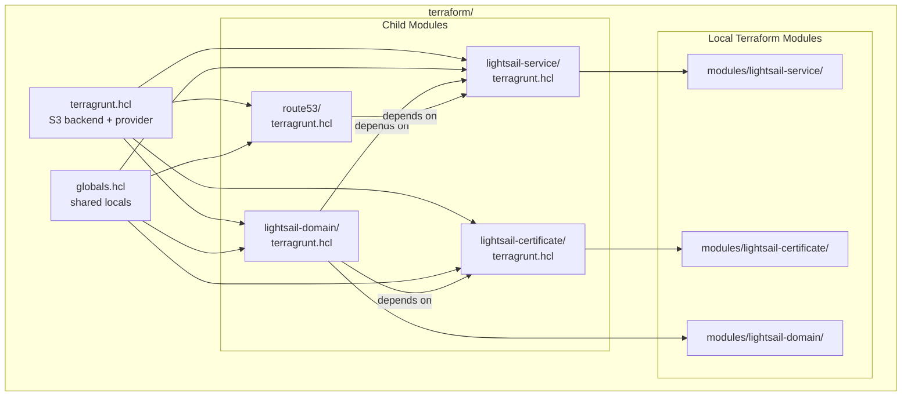

# Design Document

## Overview

This design replaces the imperative AWS CLI Makefile targets for Lightsail service lifecycle management with declarative Terragrunt/Terraform modules. The new modules follow the established project pattern: root `terragrunt.hcl` with S3 backend, `globals.hcl` for shared locals, and child directories with individual `terragrunt.hcl` files.

Since no community Terragrunt module exists for Lightsail resources, each child module uses an inline `terraform { source = "..." }` block pointing to a local Terraform module directory. The Route53 record continues using the community `terraform-aws-modules/terraform-aws-route53` module (same pattern as the existing `terraform/route53/terragrunt.hcl`).

### Design Decisions

1. **Inline terraform blocks with local modules**: Lightsail resources have no maintained community Terragrunt wrappers. We define small local Terraform modules under `terraform/modules/lightsail-service/` and `terraform/modules/lightsail-certificate/` and reference them via relative paths.

2. **Domain attachment as part of the service module**: Rather than a separate module, the `public_domain_names` attribute is configured directly on the `aws_lightsail_container_service` resource within the service module. A separate `lightsail-domain` Terragrunt child reads outputs from both the service and certificate modules and applies the attachment via `aws_lightsail_container_service_public_domain_names`.

3. **Route53 uses community module**: The existing pattern with `terraform-aws-modules/terraform-aws-route53` is preserved, only updating the dependency from `alb` to `lightsail-service` and switching from an alias record to a CNAME.

4. **State import before first apply**: Since the Lightsail service, certificate, and Route53 record already exist, `terraform import` commands are provided in a script to adopt existing resources without recreation.

5. **Stale modules removed in a separate step**: ECS/ALB/VPC directories are deleted after state cleanup to avoid orphan state references.

## Architecture



### Dependency Graph

```
lightsail-certificate (no deps)
lightsail-service (no deps)
    └── lightsail-domain (depends on: lightsail-service, lightsail-certificate)
    └── route53 (depends on: lightsail-service)
```

Terragrunt resolves this DAG automatically via `dependency` blocks. `run-all apply` will create the service and certificate first (in parallel), then the domain attachment, then the Route53 record.

## Components and Interfaces

### 1. Local Terraform Module: `modules/lightsail-service/`

**Files**: `main.tf`, `variables.tf`, `outputs.tf`

**Purpose**: Defines the `aws_lightsail_container_service` resource.

**Inputs**:
| Variable | Type | Default | Description |
|----------|------|---------|-------------|
| `service_name` | string | — | Lightsail container service name |
| `power` | string | `"nano"` | Container service power tier |
| `scale` | number | `1` | Number of running instances |
| `tags` | map(string) | `{}` | Resource tags |

**Outputs**:
| Output | Description |
|--------|-------------|
| `service_name` | Name of the container service |
| `url` | Public URL of the service (e.g. `https://xxx.us-east-2.cs.amazonlightsail.com`) |

### 2. Local Terraform Module: `modules/lightsail-certificate/`

**Files**: `main.tf`, `variables.tf`, `outputs.tf`

**Purpose**: Defines the `aws_lightsail_certificate` resource.

**Inputs**:
| Variable | Type | Default | Description |
|----------|------|---------|-------------|
| `certificate_name` | string | — | Certificate name in Lightsail |
| `domain_name` | string | — | Domain the certificate covers |

**Outputs**:
| Output | Description |
|--------|-------------|
| `certificate_name` | Name of the issued certificate |

### 3. Local Terraform Module: `modules/lightsail-domain/`

**Files**: `main.tf`, `variables.tf`, `outputs.tf`

**Purpose**: Defines the `aws_lightsail_container_service_public_domain_names` resource linking a certificate to a service domain.

**Inputs**:
| Variable | Type | Default | Description |
|----------|------|---------|-------------|
| `service_name` | string | — | Lightsail container service name |
| `certificate_name` | string | — | Certificate name to use |
| `domain_name` | string | — | Domain to attach |

**Outputs**: none (side-effect only)

### 4. Terragrunt Child: `lightsail-service/terragrunt.hcl`

References `../modules/lightsail-service` via relative path. Reads globals for service name, power, scale, and tags.

### 5. Terragrunt Child: `lightsail-certificate/terragrunt.hcl`

References `../modules/lightsail-certificate` via relative path. Reads globals for certificate name and domain.

### 6. Terragrunt Child: `lightsail-domain/terragrunt.hcl`

References `../modules/lightsail-domain` via relative path. Declares `dependency` blocks on `lightsail-service` and `lightsail-certificate`.

### 7. Terragrunt Child: `route53/terragrunt.hcl` (updated)

Uses the community module `terraform-aws-modules/terraform-aws-route53//modules/records`. Changes:
- Dependency switches from `../alb` to `../lightsail-service`.
- Record type changes from `A` (alias) to `CNAME`.
- Target comes from `lightsail-service` URL output (with `https://` stripped).

### 8. `globals.hcl` Updates

New locals added:
```hcl
lightsail_service_name     = "scion-chargen"
lightsail_power            = "nano"
lightsail_scale            = 1
lightsail_domain           = "scion-chargen.tulta-munille.com"
lightsail_certificate_name = "tulta-munille-cert"
```

### 9. Makefile Changes

**Added targets** (in a new `terraform.mk` or inline):
- `plan` — `cd terraform && terragrunt run-all plan`
- `apply` — `cd terraform && terragrunt run-all apply`
- `destroy` — `cd terraform && terragrunt run-all destroy`

**Removed targets** from `docker.mk`:
- `ls-create-service`
- `ls-create-cert`
- `ls-cert-status`
- `ls-attach-domain`
- `ls-dns-setup`

**Retained targets**:
- `build`, `build-no-cache`, `run-docker`, `stop-docker`, `clean`
- `ls-push`, `ls-deploy`, `deploy`, `ls-status`, `ls-logs`

### 10. State Import Script: `terraform/scripts/import.sh`

A shell script listing `terragrunt import` commands for each resource:
```bash
# lightsail-service
cd ../lightsail-service && terragrunt import aws_lightsail_container_service.this scion-chargen

# lightsail-certificate
cd ../lightsail-certificate && terragrunt import aws_lightsail_certificate.this tulta-munille-cert

# lightsail-domain
cd ../lightsail-domain && terragrunt import aws_lightsail_container_service_public_domain_names.this scion-chargen

# route53 (CNAME record)
cd ../route53 && terragrunt import 'module.records.aws_route53_record.this["scion-chargen CNAME"]' Z04505901JV6BMGXU7TJT_scion-chargen.tulta-munille.com_CNAME
```

### 11. State Cleanup Script: `terraform/scripts/cleanup-state.sh`

Deletes orphan S3 state objects and DynamoDB lock entries for removed modules:
- `alb/terraform.tfstate`
- `certificate/terraform.tfstate`
- `ecs/service/terraform.tfstate`
- `vpc/terraform.tfstate`
- `vpc/endpoints/terraform.tfstate`
- `security-groups/terraform.tfstate`
- `iam/execution-role/terraform.tfstate`
- `iam/task-role/terraform.tfstate`
- `kms/terraform.tfstate`
- `secrets-manager/terraform.tfstate`

## Data Models

### Terraform Resource Attributes

**`aws_lightsail_container_service`**:
```hcl
resource "aws_lightsail_container_service" "this" {
  name  = var.service_name   # "scion-chargen"
  power = var.power          # "nano"
  scale = var.scale          # 1
  tags  = var.tags
}
```

**`aws_lightsail_certificate`**:
```hcl
resource "aws_lightsail_certificate" "this" {
  name        = var.certificate_name  # "tulta-munille-cert"
  domain_name = var.domain_name       # "scion-chargen.tulta-munille.com"
}
```

**`aws_lightsail_container_service_public_domain_names`**:
```hcl
resource "aws_lightsail_container_service_public_domain_names" "this" {
  service_name = var.service_name

  public_domain_names {
    certificate {
      certificate_name = var.certificate_name
      domain_names     = [var.domain_name]
    }
  }
}
```

**Route53 CNAME record** (via community module inputs):
```hcl
records = [
  {
    name    = "scion-chargen"
    type    = "CNAME"
    ttl     = 300
    records = [<lightsail-service-url>]
  }
]
```

### Globals Data (additions to `globals.hcl`)

```hcl
locals {
  # ... existing locals retained ...
  lightsail_service_name     = "scion-chargen"
  lightsail_power            = "nano"
  lightsail_scale            = 1
  lightsail_domain           = "scion-chargen.tulta-munille.com"
  lightsail_certificate_name = "tulta-munille-cert"
}
```

### Remote State Key Layout (post-migration)

```
lightsail-service/terraform.tfstate
lightsail-certificate/terraform.tfstate
lightsail-domain/terraform.tfstate
route53/terraform.tfstate
```

## Correctness Properties

Not applicable. This feature is Infrastructure as Code (Terragrunt/Terraform) — declarative configuration rather than functions with inputs and outputs. Correctness is validated through `terraform validate`, `terraform plan` output inspection, and post-apply state verification rather than property-based testing.

## Error Handling

### Terragrunt/Terraform Error Scenarios

| Scenario | Handling |
|----------|----------|
| Import fails (resource not found) | Script exits with error; user must verify resource exists in correct region |
| Plan shows unexpected destroy | User must NOT proceed with apply; likely missed import step |
| Certificate validation pending | `aws_lightsail_certificate` will remain in `PENDING_VALIDATION` state; domain attachment will fail until DNS validation records are added (already done for existing cert) |
| Dependency output unavailable | Terragrunt `mock_outputs` provide safe defaults for `validate` and `plan` commands |
| State lock contention | DynamoDB-based locking prevents concurrent modifications; retry after lock timeout |
| S3 bucket missing | Terragrunt will error on init; bucket must exist (it already does) |

### Makefile Error Handling

- `plan`/`apply`/`destroy` targets pass through Terragrunt exit codes directly
- `deploy` target (build + push + deploy) continues using existing error handling (each step fails independently)

### State Cleanup Safety

- Cleanup script prompts for confirmation before deleting state objects
- Script verifies each module directory is actually removed before deleting its state
- DynamoDB lock entries are only removed after successful state object deletion

## Testing Strategy

### Why Property-Based Testing Does Not Apply

This feature is Infrastructure as Code (IaC) — declarative Terraform/Terragrunt configuration. PBT is not appropriate because:
- Terraform modules are declarative configuration, not functions with inputs/outputs
- There is no meaningful "for all inputs X, property P(X) holds" statement for IaC
- The correctness guarantee comes from `terraform plan` output matching expectations

### Testing Approach

**1. Terraform Validate** (syntax and provider schema):
- Run `terragrunt run-all validate` across all child modules
- Catches HCL syntax errors, missing required variables, and type mismatches

**2. Plan Output Verification** (integration):
- After import, run `terragrunt run-all plan` and verify "No changes" output
- Before any intentional change, review plan diff for expected modifications only

**3. Module-Level Plan Tests**:
- Each child module can be planned independently with mock dependency outputs
- Verify plan creates expected resources with correct attributes

**4. Import Verification**:
- After running `import.sh`, each module's `terragrunt plan` should show zero changes
- If plan shows changes, the module definition doesn't match the live resource

**5. Makefile Target Tests** (manual/smoke):
- `make plan` completes without error
- `make apply` is idempotent after initial import
- Removed targets (`ls-create-service`, etc.) are no longer available
- Retained targets (`ls-push`, `ls-deploy`, etc.) still work

**6. Cleanup Verification**:
- After running `cleanup-state.sh`, `terragrunt run-all plan` does not reference deleted modules
- S3 bucket no longer contains state files for removed module paths
