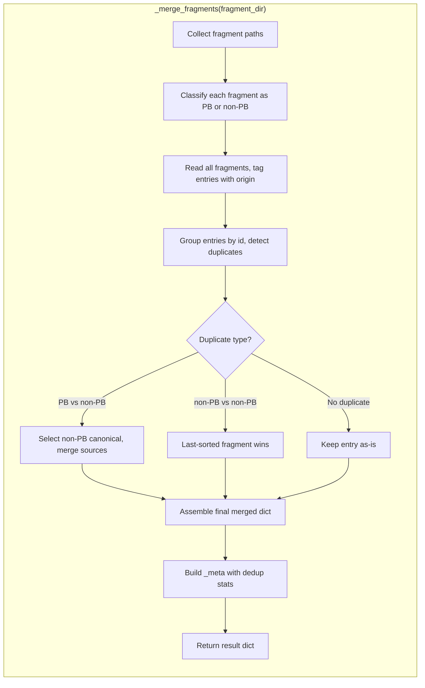

# Design Document: Pandora's Box Deduplication

## Overview

This feature extends the existing merge engine (`src/scripts/merge_engine.py`) with deduplication logic that detects entries sharing the same `id` across Pandora's Box fragments and other source book fragments. When a duplicate is detected, the non-Pandora's Box entry is treated as canonical (retaining all field values), while the `source` fields from both entries are merged into a comma-separated string citing both locations.

The design preserves the merge engine's existing behavior for non-duplicate scenarios and for duplicates between two non-Pandora's Box sources (last-wins). It adds a targeted interception layer within `_merge_fragments` that:
1. Identifies which fragments originate from Pandora's Box (by filename or `_meta.bookSlug`)
2. Detects duplicate `id` keys across PB and non-PB fragments
3. Selects the non-PB entry as canonical, merging source fields
4. Reports deduplication statistics in the output `_meta` block

### Design Rationale

1. **Minimal invasiveness**: The deduplication logic is added within the existing `_merge_fragments` function rather than creating a separate pipeline stage, keeping the public API unchanged.
2. **Two-pass merge**: A first pass collects all entries by `id` with origin metadata, then a second pass resolves duplicates. This avoids order-dependence and makes the result deterministic.
3. **Fragment-level PB identification**: Detecting Pandora's Box at the fragment level (not entry level) is simpler and matches the real-world data layout where entire files come from a single book.
4. **Additive reporting**: Deduplication stats are added to the existing `_meta` block structure, preserving backward compatibility.

## Architecture



### Data Flow

1. `_collect_fragments()` returns sorted fragment paths (unchanged)
2. New `_is_pandoras_box_fragment(path, meta)` classifies each fragment
3. Entries are collected into a per-id accumulator: `{id: [(entry, is_pb, filename), ...]}`
4. Duplicate resolution produces the final entry for each id
5. `_meta` block is enriched with `deduplicatedCount` and `deduplicatedIds`

## Components and Interfaces

### 1. Fragment Classification (`_is_pandoras_box_fragment`)

```python
def _is_pandoras_box_fragment(path: Path, meta: dict[str, Any] | None) -> bool:
    """Determine if a fragment originates from Pandora's Box.

    A fragment is classified as Pandora's Box if:
    - Its filename contains 'Pandoras_Box' (case-insensitive), OR
    - Its _meta.bookSlug equals 'pandoras_box'

    Args:
        path: Path to the fragment file.
        meta: The _meta dict extracted from the fragment (may be None).

    Returns:
        True if the fragment is from Pandora's Box.
    """
```

### 2. Duplicate Resolution (`_resolve_duplicates`)

```python
def _resolve_duplicates(
    entries_by_id: dict[str, list[tuple[dict, bool, str]]],
) -> tuple[dict[str, dict], list[str]]:
    """Resolve duplicate entries across fragments.

    For each id with multiple entries:
    - If any entry is from PB and any from non-PB: select last non-PB entry
      as canonical, merge all source fields (non-PB first, PB last).
    - If all entries are non-PB: last-sorted fragment's entry wins (existing behavior).
    - If all entries are PB-only: last-sorted fragment's entry wins.

    Args:
        entries_by_id: Mapping of entry id to list of (entry_dict, is_pb, filename).

    Returns:
        Tuple of (resolved_entries_dict, deduplicated_ids_list).
    """
```

### 3. Source Field Merger (`_merge_source_fields`)

```python
def _merge_source_fields(
    entries: list[tuple[dict, bool, str]],
) -> str:
    """Merge source fields from multiple entries into a comma-separated string.

    Non-PB sources appear first (in fragment sort order), PB sources last.
    Values are separated by ', ' (comma + space).

    Args:
        entries: List of (entry_dict, is_pb, filename) sorted by filename.

    Returns:
        Merged source string.
    """
```

### 4. Enhanced `_merge_fragments` (modified)

The existing `_merge_fragments` function is modified to:
1. Classify each fragment after reading
2. Collect entries with origin metadata instead of direct dict merge
3. Call `_resolve_duplicates` to produce the final entry set
4. Add deduplication stats to `_meta`

The public API (`merge_boon_catalog`, `merge_table_fragments`) remains unchanged.

## Data Models

### Fragment Entry (existing, unchanged)

```python
# Each entry in a fragment JSON is keyed by id:
{
    "id": "artistry_dot_01",
    "name": "Boon Name",
    "purview": "artistry",
    "dot": 1,
    "tierMin": "hero",
    "legendMin": 0,
    "requiresBoonIds": [],
    "description": "...",
    "mechanicalEffects": "...",
    "source": "Some_Book.pdf — Section (Entry Name)",
    # ... other fields vary by table type
}
```

### Entry Accumulator (internal, new)

```python
# During merge, entries are accumulated per-id with origin metadata:
entries_by_id: dict[str, list[tuple[dict, bool, str]]] = {
    "artistry_dot_01": [
        (entry_dict_from_pb, True, "00_SCION_Pandoras_Box_Revised.json"),
        (entry_dict_from_other, False, "20_Scion_Players_Guide.json"),
    ],
}
```

### Deduplication Meta (new fields in `_meta`)

```python
# Added to the output _meta block:
{
    "_meta": {
        # ... existing fields ...
        "deduplicatedCount": 42,        # int: number of PB duplicates resolved
        "deduplicatedIds": [            # list[str]: ids that were deduplicated
            "artistry_dot_01",
            "darkness_dot_02",
        ],
    }
}
```

### Merged Source Field Format

```
"source": "Scion_Origin.pdf — Section (Name), Scion_Pandoras_Box.pdf — Section (Name)"
```

Non-PB sources appear first in fragment-sort order, PB source(s) appear last. Separator is `, `.


## Correctness Properties

*A property is a characteristic or behavior that should hold true across all valid executions of a system — essentially, a formal statement about what the system should do. Properties serve as the bridge between human-readable specifications and machine-verifiable correctness guarantees.*

### Property 1: Canonical Entry Field Preservation

*For any* set of fragments where a Pandora's Box fragment and one or more non-Pandora's Box fragments share the same entry `id`, the merged output entry SHALL have all field values (except `source`) identical to the last-sorted non-Pandora's Box fragment's entry for that `id`.

**Validates: Requirements 1.3, 2.1, 2.2, 2.3**

### Property 2: Non-PB Duplicate Last-Wins Preserved

*For any* set of fragments where two or more non-Pandora's Box fragments (and no Pandora's Box fragment) contain entries with the same `id`, the merged output entry SHALL have all field values identical to the entry from the last-sorted fragment (preserving existing behavior).

**Validates: Requirements 1.4**

### Property 3: Source Field Merging Order

*For any* Pandora's Box deduplication scenario involving N fragments (at least one PB and at least one non-PB) sharing the same entry `id`, the merged `source` field SHALL be a comma-space (`, `) separated string containing all source values, with non-PB sources appearing first in fragment-sort order followed by PB source(s) last.

**Validates: Requirements 3.1, 3.2, 3.3, 3.4**

### Property 4: Pandora's Box Fragment Classification

*For any* file path containing the substring "Pandoras_Box" (case-insensitive) OR any fragment whose `_meta.bookSlug` equals `"pandoras_box"`, the classification function SHALL return True. For any path that does NOT contain that substring AND whose meta does NOT have that bookSlug, the function SHALL return False.

**Validates: Requirements 4.1, 4.2, 4.3**

### Property 5: Unique Pandora's Box Entry Preservation

*For any* Pandora's Box fragment entry whose `id` does not appear in any other fragment within the same merge, the merged output SHALL contain that entry with all fields (including `source`) unchanged from the original.

**Validates: Requirements 5.1, 5.2**

### Property 6: Deterministic Sorted Output

*For any* set of fragments, running the merge function twice on the same input SHALL produce byte-identical JSON output, and the non-meta keys in the output SHALL be in sorted order.

**Validates: Requirements 6.1, 6.2, 6.3**

### Property 7: Deduplication Reporting Accuracy

*For any* merge that resolves K Pandora's Box duplicates, the output `_meta.deduplicatedCount` SHALL equal K, and `_meta.deduplicatedIds` SHALL be a list containing exactly the K `id` values that were deduplicated (in sorted order).

**Validates: Requirements 7.1, 7.3**

## Error Handling

| Scenario | Behavior |
|----------|----------|
| Fragment missing `source` field | Use empty string `""` as that entry's source contribution in the merged field |
| Fragment with `_meta` but no `bookSlug` | Classification relies solely on filename pattern |
| Fragment with malformed `_meta` (not a dict) | Treat as non-PB, no bookSlug available |
| All fragments are PB (no non-PB duplicates) | Last-wins among PB fragments; no deduplication reported |
| Entry `source` field contains commas | Preserved as-is within the comma-separated list (each entry's source is treated as an opaque string) |
| Empty fragment directory | Return empty dict (existing behavior, no deduplication metadata added) |
| Single fragment (PB or non-PB) | No duplicates possible; `deduplicatedCount` = 0, `deduplicatedIds` = [] |

## Testing Strategy

### Property-Based Tests (Hypothesis)

The project already uses Hypothesis for property-based testing (see `tests/test_parser_framework/test_properties.py` and the `conftest.py` Hypothesis profile configuration). Each correctness property above maps to a dedicated Hypothesis test class.

**Configuration:**
- Library: [Hypothesis](https://hypothesis.readthedocs.io/) (already a project dependency)
- Minimum iterations: 100 per property (200 for the "dev" profile, 500 for "ci")
- Tag format: `Feature: pandoras-box-deduplication, Property {N}: {title}`

**Strategies needed:**
- `fragment_entry`: Generates entries with random id, name, source, and optional fields
- `pb_filename`: Generates filenames containing "Pandoras_Box" in various casings
- `non_pb_filename`: Generates filenames that do NOT contain "Pandoras_Box"
- `fragment_set`: Generates a set of PB and non-PB fragment files with controlled id overlap

### Unit Tests (pytest)

Unit tests cover specific examples and edge cases not suited for property generation:

- Verbose logging output verification (Requirement 7.2)
- Integration with `merge_boon_catalog` and `merge_table_fragments` public API
- Real-world fragment patterns (e.g., `00_SCION_Pandoras_Box_Revised.json` + `20_Scion_Players_Guide_Saints_Monsters.json`)
- Empty/missing source field handling
- Fragments identified by `_meta.bookSlug` only (filename doesn't match)

### Test File Location

- Property tests: `tests/test_parser_framework/test_dedup_properties.py`
- Unit tests: `tests/test_parser_framework/test_dedup_merge.py`
