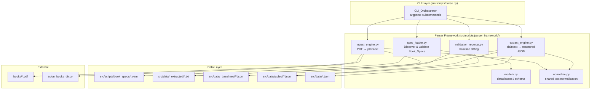
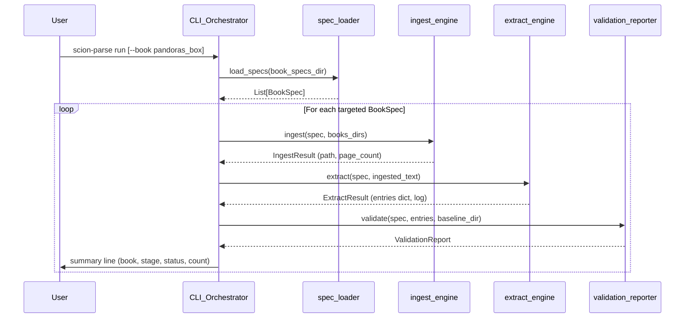

# Design Document: PDF Parser Framework

## Overview

The PDF Parser Framework replaces the existing collection of 8 nearly-identical ingest scripts and ad-hoc extraction modules with a unified, declarative pipeline. The framework introduces a layered architecture:

1. **Book Spec Layer** — YAML files that describe each book's extraction rules as data
2. **Ingest Engine** — Shared PDF-to-plaintext extraction using pypdf
3. **Extract Engine** — Section-finding and field extraction driven by Book Spec declarations
4. **Validation Reporter** — Baseline comparison and regression detection
5. **CLI Orchestrator** — Single entrypoint (`scion-parse`) replacing manual script chaining

The framework lives as a Python package at `src/scripts/parser_framework/` and is consumed by the CLI module at `src/scripts/parse.py`. Existing scripts remain in-place during migration and are retired one-by-one as equivalent Book Specs are validated.

### Design Rationale

- **YAML for Book Specs** over JSON: better readability for multi-line regex patterns, comments for documenting anchors, and natural list syntax for filename candidates. JSON is accepted for machine-generated specs.
- **Package in `src/scripts/`** rather than `src/app/`: the framework is a developer tool, not a runtime dependency. It shares `sys.path` with existing scripts and imports from `app.services.data_tables` for output path resolution.
- **pypdf as default, pymupdf as opt-in**: pypdf produces adequate plain text for most books. pymupdf (fitz) gives structural layout data needed for Pandora's Box boon mechanics where positional extraction matters.

## Architecture



### Pipeline Flow



## Components and Interfaces

### 1. `models.py` — Data Models

Defines the schema for Book Specs and pipeline results as Python dataclasses.

```python
@dataclass
class SectionAnchor:
    pattern: str                    # literal text or regex
    pattern_type: Literal["literal", "regex"]  # default: "literal"
    case_insensitive: bool = False  # only for regex type
    aliases: list[str] | None = None  # alternative match strings

@dataclass  
class HeadingPattern:
    regex: str                      # Python re-compatible pattern
    flags: list[str] | None = None  # e.g. ["MULTILINE", "IGNORECASE"]

@dataclass
class BookSpec:
    book_id: str                    # alphanumeric + underscores, 1-64 chars
    filenames: list[str]            # candidate PDF filenames (≥1)
    output_path: str                # relative to repo root
    section_anchors: list[SectionAnchor]
    heading_patterns: list[HeadingPattern]
    expected_fields: list[str]      # field names to extract per entry
    pipeline_stages: list[Literal["ingest", "extract", "validate"]]
    extraction_mode: Literal["pypdf", "pymupdf"] = "pypdf"
    noise_line_regex: str | None = None  # page-header removal pattern

@dataclass
class IngestResult:
    book_id: str
    output_path: Path
    page_count: int
    errors: list[str]               # page-level extraction errors

@dataclass
class ExtractResult:
    book_id: str
    entries: dict[str, dict[str, str | None]]
    log: list[LogEntry]

@dataclass
class LogEntry:
    book_id: str
    entry_id: str | None
    field: str | None
    reason: Literal["not_found", "section_missing", "heading_unmatched", "anchor_not_found"]
    detail: str | None = None

@dataclass
class ValidationReport:
    book_id: str
    table_name: str
    timestamp: str
    total_entries: int
    regressions: dict[str, int]     # severity → count
    flagged: list[FlaggedEntry]
    status: Literal["ok", "warning", "error", "skipped_due_to_errors"]
```

### 2. `spec_loader.py` — Book Spec Discovery and Validation

```python
def load_specs(specs_dir: Path) -> list[BookSpec]:
    """Discover all .yaml/.yml/.json files, parse, validate, return BookSpecs.
    
    Raises:
        SpecValidationError: missing required field, duplicate book_id, 
                            empty filenames, invalid pipeline stage.
    """

def validate_spec(raw: dict, source_file: Path) -> BookSpec:
    """Validate a single parsed spec dict against the schema."""
```

### 3. `ingest_engine.py` — PDF to Plaintext

```python
def ingest(spec: BookSpec, search_dirs: list[Path]) -> IngestResult:
    """Resolve PDF, extract text page-by-page, write to output_path.
    
    Raises:
        FileNotFoundError: PDF not found in any search directory.
    """

def resolve_pdf(spec: BookSpec, search_dirs: list[Path]) -> Path:
    """Find the first existing PDF from spec.filenames across search_dirs."""
```

### 4. `extract_engine.py` — Structured Extraction

```python
def extract(spec: BookSpec, text: str) -> ExtractResult:
    """Locate sections, identify headings, extract fields per entry."""

def find_section(text: str, anchor: SectionAnchor) -> tuple[int, int] | None:
    """Return (start, end) of section, applying normalization and fuzzy fallback."""

def extract_fields(block: str, expected_fields: list[str]) -> dict[str, str | None]:
    """Scan entry block for field:value lines."""

def extract_pymupdf(spec: BookSpec, pdf_path: Path) -> ExtractResult:
    """pymupdf-based structured extraction for books requiring layout awareness."""
```

### 5. `normalize.py` — Shared Normalization

```python
def normalize_text(s: str) -> str:
    """NFKD + soft-hyphen removal + smart-quote replacement + whitespace collapse."""

def normalize_heading(s: str) -> str:
    """Full heading normalization pipeline (NFKD, smart-quotes, uppercase, whitespace)."""

def fuzzy_find_anchor(needle: str, lines: list[str], max_distance: int = 2) -> tuple[int, str, int] | None:
    """Find best fuzzy match for anchor in lines. Returns (line_index, matched_text, distance)."""

def whitespace_insensitive_find(needle: str, haystack: str) -> int:
    """Find needle in haystack ignoring whitespace differences. Returns char offset or -1."""
```

### 6. `validation_reporter.py` — Baseline Comparison

```python
def validate(spec: BookSpec, entries: dict, baseline_dir: Path, update: bool = False) -> ValidationReport:
    """Compare extraction output against stored baseline."""

def compute_content_hash(entry: dict) -> str:
    """SHA-256 of canonical JSON representation of entry."""

def load_baseline(path: Path) -> dict | None:
    """Load existing baseline or return None."""

def save_baseline(path: Path, entries: dict) -> None:
    """Write new baseline snapshot."""
```

### 7. `src/scripts/parse.py` — CLI Entrypoint

```python
# Registered as console_scripts entry or invoked as `python -m scripts.parse`

def build_parser() -> argparse.ArgumentParser:
    """Build argparse with subcommands: ingest, extract, validate, run, generate-spec."""

def cmd_run(args) -> int:
    """Execute ingest → extract → validate in sequence."""

def cmd_generate_spec(args) -> int:
    """Parse existing ingest script and emit skeleton Book_Spec YAML."""
```

## Data Models

### Book Spec Schema (YAML)

```yaml
# src/scripts/book_specs/pandoras_box.yaml
book_id: pandoras_box
filenames:
  - "SCION_Pandoras_Box_(Revised_Download).pdf"
  - "SCION_Pandoras_Box_Revised.pdf"
  - "Pandoras_Box_Revised.pdf"
  - "Pandoras_Box_Finale.pdf"
output_path: "src/data/_extracted/pandoras_box.txt"

section_anchors:
  - pattern: "BEAST"
    pattern_type: literal
    aliases: ["BEASTS"]
  - pattern: "^EPIC\\s+\\w+"
    pattern_type: regex
    case_insensitive: false

heading_patterns:
  - regex: "^([A-Z][A-Z0-9 '\\-\\.&,]+)\\nCost:"
    flags: ["MULTILINE"]

expected_fields:
  - Cost
  - Duration
  - Subject
  - Range
  - Action
  - Clash

pipeline_stages:
  - ingest
  - extract
  - validate

extraction_mode: pymupdf

noise_line_regex: "^Boons\\s+\\d+$"
```

### Baseline Snapshot Schema

```json
{
  "book_id": "pandoras_box",
  "table_name": "boonPbMechanics",
  "generated_at": "2025-01-15T10:30:00Z",
  "entry_count": 156,
  "entries": {
    "beast_dot_01": {
      "hash": "a1b2c3d4...",
      "fields": ["description", "mechanicalEffects"]
    },
    "beast_dot_02": {
      "hash": "e5f6g7h8...",
      "fields": ["description", "mechanicalEffects"]
    }
  }
}
```

### Validation Report Schema

```json
{
  "book_id": "pandoras_box",
  "table_name": "boonPbMechanics",
  "timestamp": "2025-01-15T10:31:00Z",
  "total_entries": 156,
  "regressions": {
    "missing_entry": 0,
    "new_entry": 2,
    "content_changed": 3
  },
  "flagged": [
    {
      "key": "chaos_dot_05",
      "severity": "content_changed",
      "old_hash": "abc123...",
      "new_hash": "def456..."
    }
  ]
}
```

### Module Layout

```
src/scripts/
├── parser_framework/
│   ├── __init__.py          # Public API exports
│   ├── models.py            # BookSpec, results, log entries
│   ├── spec_loader.py       # YAML/JSON discovery and validation
│   ├── ingest_engine.py     # PDF → plaintext
│   ├── extract_engine.py    # Plaintext → structured JSON
│   ├── normalize.py         # Unicode normalization, fuzzy matching
│   └── validation_reporter.py  # Baseline comparison
├── book_specs/
│   ├── pandoras_box.yaml
│   ├── scion_origin.yaml
│   ├── scion_hero.yaml
│   ├── mysteries_of_the_world.yaml
│   ├── masks_of_the_mythos.yaml
│   ├── saints_monsters.yaml
│   ├── titans_rising.yaml
│   └── scion_dragon.yaml
├── parse.py                 # CLI entrypoint (scion-parse)
└── ... (existing scripts, untouched until migrated)
```


## Correctness Properties

*A property is a characteristic or behavior that should hold true across all valid executions of a system — essentially, a formal statement about what the system should do. Properties serve as the bridge between human-readable specifications and machine-verifiable correctness guarantees.*

### Property 1: Path Resolution Priority Order

*For any* set of search directories and filename candidates where exactly one candidate exists at a known position in the directory list, the `resolve_pdf` function SHALL return that file, and it SHALL always prefer a match in an earlier-priority directory over a match in a later-priority directory (even if the later directory has an earlier-declared filename).

**Validates: Requirements 1.1, 5.5, 7.5**

### Property 2: Newline Normalization Invariant

*For any* string, after applying the Ingest_Engine's newline normalization, the output SHALL never contain four or more consecutive newline characters. Applying the normalization a second time SHALL produce an identical result (idempotence).

**Validates: Requirements 1.2**

### Property 3: FileNotFoundError Message Completeness

*For any* BookSpec with a non-empty `book_id`, a non-empty `filenames` list, and a non-empty list of search directories (none containing a matching file), the raised `FileNotFoundError` message SHALL contain the `book_id` string, every filename from the candidates list, and every directory path from the search list.

**Validates: Requirements 1.3**

### Property 4: Graceful Page Error Handling

*For any* PDF with N pages where a subset of pages raise extraction errors, the output text SHALL contain exactly N page markers, one error marker `[page K: extract error: ...]` for each failed page K, and extracted text for all non-failing pages. No failing page SHALL prevent extraction of other pages.

**Validates: Requirements 1.5**

### Property 5: Spec Discovery by Extension

*For any* directory containing files with extensions `.yaml`, `.yml`, `.json`, `.txt`, `.py`, and `.md`, the spec loader SHALL return specs only from files with extensions `.yaml`, `.yml`, or `.json`, and the count of loaded specs SHALL equal the count of valid spec files with those extensions.

**Validates: Requirements 2.1**

### Property 6: Spec Validation Error Reporting

*For any* BookSpec dict that violates one or more validation rules (missing required field, duplicate book_id across specs, empty filenames list, invalid pipeline stage name, or invalid book_id format), the raised validation error message SHALL identify the source file path and the specific field or value that failed validation.

**Validates: Requirements 2.2, 2.3, 2.6**

### Property 7: Literal Anchor Matching is Whitespace and Case Insensitive

*For any* Section_Anchor with `pattern_type: literal` and any text containing that anchor's content with arbitrary whitespace expansion (spaces, tabs, newlines collapsed to single space) and case variation, the match SHALL succeed. Conversely, for regex-type anchors without the case-insensitive flag, a case-changed version of the text SHALL NOT match.

**Validates: Requirements 2.4, 6.1**

### Property 8: Alias Resolution Uses Declaration Order

*For any* Section_Anchor with N aliases where the text contains matches for aliases at indices i and j (i < j in declaration order), the resolver SHALL use the alias at index i (the earlier-declared one), regardless of the textual position of either match.

**Validates: Requirements 2.5**

### Property 9: Section and Heading Partitioning

*For any* ingested text with K section anchors matching successfully and M headings within a section, the extracted blocks SHALL form a complete partition of the section text: the concatenation of all heading blocks (in order) SHALL equal the section text between the first heading and the section boundary, with no gaps and no overlaps. The number of extracted blocks SHALL equal the number of matched headings.

**Validates: Requirements 3.1, 3.2**

### Property 10: Heading Normalization Idempotence

*For any* Unicode string, applying `normalize_heading` once and applying it twice SHALL produce the same result. The output SHALL never contain soft-hyphens (U+00AD), smart quotes (U+2018–U+201D), en-dashes (U+2013), or consecutive whitespace characters.

**Validates: Requirements 3.3**

### Property 11: Field Extraction Round-Trip

*For any* set of field names and corresponding non-empty values (containing no newlines or colons), constructing a text block with lines in the format `FieldName: value` and then running `extract_fields` SHALL return a dictionary mapping each field name to its value (with interior whitespace collapsed to single spaces).

**Validates: Requirements 3.4**

### Property 12: Missing Fields Produce Null and Log Entry

*For any* entry block and set of expected fields where one or more fields are absent from the block text, the extraction result SHALL contain `null` for each missing field, and the structured log SHALL contain one entry per missing field with the correct entry identifier, field name, and reason code `not_found`.

**Validates: Requirements 3.5**

### Property 13: Unmatched Anchor Produces Skip and Log

*For any* BookSpec with section anchors where one or more anchors cannot be found in the text (even after normalization and fuzzy matching), the extraction SHALL skip those sections, continue extracting from remaining matched sections, and produce a log entry per missed anchor with reason code `section_missing` or `anchor_not_found`.

**Validates: Requirements 3.7, 6.3**

### Property 14: Fuzzy Match Accepts Exactly Within Threshold

*For any* normalized anchor string and any text line where the Levenshtein distance between them is ≤ 2, the fuzzy matcher SHALL accept the line. For any line where the distance is > 2, the fuzzy matcher SHALL reject the line.

**Validates: Requirements 6.2**

### Property 15: Noise Line Removal Preserves Non-Noise Content

*For any* text block and noise-line regex, after noise removal: (a) no remaining line SHALL match the noise regex, and (b) every line from the original that did NOT match the noise regex SHALL be present in the output in its original order and content.

**Validates: Requirements 6.4**

### Property 16: Baseline Regression Detection Correctness

*For any* baseline snapshot and current extraction output, the validation report SHALL flag: every key in the baseline but not in current as `missing_entry`, every key in current but not in baseline as `new_entry`, and every key present in both whose content hash differs as `content_changed`. The total count of flags SHALL equal the sum of these three sets, with no duplicates.

**Validates: Requirements 4.2, 4.3, 4.4**

### Property 17: First-Run Baseline Creation

*For any* extraction result when no prior baseline file exists, running validation SHALL produce a report with zero regressions (all severity counts = 0) and SHALL create a baseline file whose entry hashes match the current output.

**Validates: Requirements 4.7**

### Property 18: Exit Code Reflects Worst Status

*For any* collection of stage results with statuses from {`ok`, `warning`, `error`}, the CLI exit code SHALL be 0 if and only if no result has status `error`. If any result has status `error`, the exit code SHALL be 1.

**Validates: Requirements 5.7**

### Property 19: Pretty-Printer Round-Trip

*For any* valid BookSpec object, serializing it via the pretty-printer to YAML and then deserializing the result SHALL produce an object with identical field names and values (deep equality) to the original.

**Validates: Requirements 8.4**

### Property 20: JSON Output Formatting

*For any* non-empty extraction dictionary, writing it via the framework's JSON output function SHALL produce a file that: (a) is valid UTF-8, (b) uses exactly 2-space indentation, and (c) ends with a single newline character.

**Validates: Requirements 7.3**

## Error Handling

### Error Categories

| Category | Example | Behavior |
|----------|---------|----------|
| **Fatal (halt book)** | PDF not found, spec validation failure | Raise exception, report `error` status, skip downstream stages for that book |
| **Page-level (continue)** | Single page extraction failure | Insert error marker, continue remaining pages |
| **Section-level (continue)** | Anchor not found, heading unmatched | Log structured entry, skip section, continue other sections |
| **Field-level (continue)** | Expected field missing from entry | Set to `null`, log with reason code |
| **Warning (informational)** | Fuzzy match used (distance 1-2), cosmetic heading differences | Log warning, continue normally |

### Structured Logging

All non-fatal issues are captured in a `list[LogEntry]` attached to the extraction result:

```python
@dataclass
class LogEntry:
    book_id: str
    entry_id: str | None
    field: str | None
    reason: Literal["not_found", "section_missing", "heading_unmatched", "anchor_not_found"]
    detail: str | None = None
```

The CLI prints a count of log entries per severity in the summary line. The full log is optionally written to `src/data/_extracted/<book_id>.log.json` when `--verbose` is passed.

### Validation Error Behavior

- Spec validation errors are raised at load time (before any pipeline execution)
- Multiple validation errors are collected and raised together so the developer can fix all at once
- Each error identifies the file path and the specific failing field/value

### Exit Codes

| Code | Meaning |
|------|---------|
| 0 | All targeted books completed with `ok` or `warning` |
| 1 | At least one book produced `error`, or no specs found, or invalid --book ID |

## Testing Strategy

### Property-Based Testing

This feature is well-suited for property-based testing because it involves:
- Text normalization functions (pure, deterministic, wide input space)
- Set comparison logic (baseline diffing)
- Path resolution with priority ordering
- Schema validation with many possible invalid inputs
- Round-trip properties (serialize/deserialize, pretty-print)

**Library**: [Hypothesis](https://hypothesis.readthedocs.io/) (Python's standard PBT library, already compatible with pytest)

**Configuration**:
- Minimum 100 examples per property test
- Use `@settings(max_examples=200)` for normalization and fuzzy-matching properties
- Each test tagged with: `# Feature: pdf-parser-framework, Property N: <title>`

**Property tests cover**: Properties 1–20 as defined in Correctness Properties above.

### Unit Tests (Example-Based)

Unit tests complement property tests for specific scenarios and integration points:

- **Extraction mode selection** (3.6): Verify default is pypdf, explicit pymupdf selects fitz
- **Dry-run behavior** (7.4): Verify no files are written
- **CLI subcommand routing** (5.1, 5.2): Verify correct stage dispatch
- **Pipeline halt-on-error** (5.4): Mock stages, verify ordering
- **First-run vs. existing baseline** (4.6, 4.8): Specific state transitions
- **Unknown book ID error** (5.3, 5.9): Specific error messages

### Integration Tests

- **End-to-end pipeline**: Run `scion-parse run --book pandoras_box` against a real PDF and compare output against existing script output
- **data_tables compatibility** (7.6): Load framework output via `load_merged_table` and verify schema matches legacy
- **Output path correctness** (7.1): Verify files land at expected paths

### Test File Organization

```
tests/
├── test_parser_framework/
│   ├── test_properties.py      # All 20 property-based tests
│   ├── test_normalize.py       # Unit tests for normalize.py
│   ├── test_spec_loader.py     # Unit tests for spec loading
│   ├── test_ingest_engine.py   # Unit tests for ingestion
│   ├── test_extract_engine.py  # Unit tests for extraction
│   ├── test_validation.py      # Unit tests for baseline diffing
│   ├── test_cli.py             # CLI integration tests
│   └── conftest.py             # Shared fixtures, temp dirs, mock PDFs
```

### Dependency Addition

Add to `requirements.txt` (dev dependencies):
```
hypothesis>=6.100,<7
pytest>=8.0,<9
pyyaml>=6.0,<7
python-Levenshtein>=0.25,<1
```

Note: `pyyaml` is needed at runtime for Book Spec loading. `python-Levenshtein` provides the fast C implementation for fuzzy matching. `hypothesis` and `pytest` are test-only dependencies.
