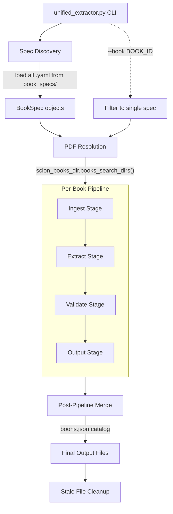
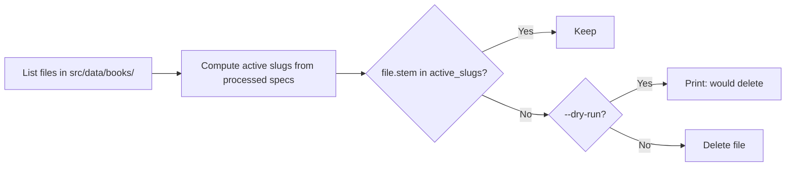

# Design Document: Unified PDF Extractor

## Overview

The Unified PDF Extractor replaces the current collection of ~14 standalone extraction scripts with a single orchestrated pipeline that processes all Scion PDFs from a configured books directory. It is driven entirely by declarative YAML Book Spec files — one per PDF — and produces every JSON data file the application consumes.

The system reuses the existing `parser_framework` module (ingest_engine, extract_engine, validation_reporter, output_writer, spec_loader) as its foundation, extending it with:
- Category-aware extraction strategies (knacks, boons, purviews, etc.)
- An extended Book Spec schema supporting multiple output paths and category declarations
- A cleanup mechanism for stale book-slice files
- A unified CLI entry point with filtering, dry-run, and verbose modes

### Design Rationale

1. **Spec-driven over code-driven**: Adding a new book requires only a YAML file, not Python code changes.
2. **Deterministic builds**: Output is fully determined by (PDFs present × Book Specs). No intermediate state is read as input.
3. **Incremental adoption**: The extended Book Spec schema is backward-compatible with existing specs. Legacy `TODO` placeholders are replaced incrementally.
4. **Single responsibility per stage**: Ingestion, extraction, validation, and output writing remain separate concerns within `parser_framework`.

## Architecture



### Pipeline Stages

1. **Spec Discovery**: Load and validate all YAML files in `src/scripts/book_specs/`.
2. **PDF Resolution**: For each spec, locate the PDF using `scion_books_dir.books_search_dirs()` with precedence: `--books-dir` > `SCION_BOOKS_DIR` > `<repo>/books` > `<repo>/../books`.
3. **Ingestion**: Extract plaintext from PDF page-by-page via pypdf or PyMuPDF, inserting page markers.
4. **Extraction**: Apply category-specific extractors using section anchors, heading patterns, and field parsers declared in the Book Spec.
5. **Validation**: Compare extraction output against baseline snapshots; flag regressions.
6. **Output Writing**: Write JSON files to declared paths using `output_writer.format_json()`.
7. **Post-Pipeline Merge**: Generate merged catalogs (e.g., `boons.json` from all boon fragments).
8. **Cleanup**: Remove stale files from `src/data/books/` that have no corresponding PDF.

## Components and Interfaces

### 1. CLI Entry Point (`src/scripts/unified_extractor.py`)

```python
def main(
    book: str | None = None,       # --book BOOK_ID: process single book
    books_dir: Path | None = None, # --books-dir DIR: override PDF directory
    dry_run: bool = False,         # --dry-run: report without writing/deleting
    verbose: bool = False,         # --verbose: write extraction logs
) -> int:
    """Return 0 on success, 1 on unrecoverable error."""
```

Responsibilities:
- Parse CLI arguments via `argparse`
- Call `spec_loader.load_specs()` to discover and validate Book Specs
- Optionally filter to a single `--book` spec
- Iterate specs, running the per-book pipeline for each
- Run post-pipeline merge and stale cleanup
- Return appropriate exit code

### 2. Spec Loader (extended `parser_framework/spec_loader.py`)

Extended to validate the new Book Spec schema fields:
- `categories` dict with per-category extraction config
- `json_output_paths` expanded to cover all categories
- `book_title` and `book_slug` metadata

### 3. PDF Resolver (`parser_framework/ingest_engine.resolve_pdf`)

Existing function. Used unchanged — accepts a `BookSpec` and `search_dirs` list.

### 4. Category Extractors (`src/scripts/extractors/`)

A new package containing category-specific extraction logic:

```
src/scripts/extractors/
├── __init__.py
├── base.py            # Abstract base class
├── knack_extractor.py
├── boon_extractor.py
├── purview_extractor.py
├── calling_extractor.py
├── birthright_extractor.py
├── equipment_extractor.py
├── path_extractor.py
├── pantheon_extractor.py
└── book_slice_extractor.py
```

#### Base Interface

```python
from abc import ABC, abstractmethod
from dataclasses import dataclass
from typing import Any

@dataclass
class CategoryResult:
    category: str
    entries: dict[str, Any]
    entry_count: int
    log: list[LogEntry]

class CategoryExtractor(ABC):
    @abstractmethod
    def extract(self, text: str, spec: BookSpec, category_config: dict) -> CategoryResult:
        """Extract entries for this category from ingested text."""
        ...

    @abstractmethod
    def validate_config(self, category_config: dict) -> list[str]:
        """Return list of validation errors for this category's config block."""
        ...
```

### 5. Merge Engine (`src/scripts/merge_engine.py`)

```python
def merge_boon_catalog(fragment_dir: Path) -> dict[str, Any]:
    """Combine all boon fragment JSONs into one merged boons.json."""

def merge_table_fragments(table_name: str, fragment_dir: Path) -> dict[str, Any]:
    """Generic merge for any table with fragments (knacks, purviews, callings)."""
```

### 6. Stale File Cleaner (`src/scripts/stale_cleaner.py`)

```python
def find_stale_files(
    books_output_dir: Path,
    active_slugs: set[str],
) -> list[Path]:
    """Return paths in books_output_dir that don't match any active slug."""

def clean_stale_files(
    stale_files: list[Path],
    dry_run: bool = False,
) -> list[Path]:
    """Delete stale files. In dry-run mode, print without deleting. Returns deleted paths."""
```

### 7. Output Writer (existing `parser_framework/output_writer.py`)

Used unchanged. Writes formatted JSON with 2-space indent, UTF-8, trailing newline.

### 8. Validation Reporter (existing `parser_framework/validation_reporter.py`)

Used unchanged. Compares extraction results against baseline snapshots.

## Data Models

### Book Spec YAML Schema (Extended)

```yaml
# Required metadata
book_id: "pandoras_box"          # Unique identifier (kebab or snake_case)
book_title: "Pandora's Box (Revised)"  # Human-readable title
book_slug: "pandoras_box"        # Output slug for src/data/books/<slug>.json

# PDF resolution
filenames:
  - "SCION_Pandoras_Box_(Revised_Download).pdf"
  - "SCION_Pandoras_Box_Revised.pdf"
  - "Pandoras_Box_Revised.pdf"

# Pipeline configuration
output_path: "src/data/_extracted/pandoras_box.txt"  # Ingested plaintext
extraction_mode: "pymupdf"       # "pypdf" (default) or "pymupdf"
noise_line_regex: "^Boons\\s+\\d+$"  # Lines to strip before extraction
pipeline_stages:
  - ingest
  - extract
  - validate

# Category declarations — each key is a Game_Data_Category
categories:
  knacks:
    output_path: "src/data/tables/knacks/00_SCION_Pandoras_Box_and_Origin_Knacks.json"
    section_anchors:
      - pattern: "Guardian Knacks"
        pattern_type: literal
      - pattern: "Creator Knacks"
        pattern_type: literal
      # ... one per calling section
    heading_pattern:
      regex: "^(?P<name>[A-Z][A-Za-z' ]+)$"
      flags: ["MULTILINE"]
    expected_fields:
      - id
      - name
      - callings
      - description
      - mechanicalEffects
      - source
      - knackKind
    calling_map:
      "Guardian Knacks": "guardian"
      "Creator Knacks": "creator"
      # ...

  boons:
    output_path: "src/data/tables/boons/00_SCION_Pandoras_Box_Revised.json"
    section_anchors:
      - pattern: "^(?P<purview>[A-Z][a-z]+)\\s+Boons$"
        pattern_type: regex
    heading_pattern:
      regex: "^(?P<name>.+?)\\s*(?P<dots>[●]+)$"
      flags: ["MULTILINE"]
    expected_fields:
      - id
      - name
      - purview
      - dot
      - tierMin
      - description
      - mechanicalEffects
      - source
    dot_symbol: "●"

  purviews:
    output_path: "src/data/tables/purviews/00_SCION_Pandoras_Box_Revised.json"
    section_anchors:
      - pattern: "Purviews"
        pattern_type: literal
    heading_pattern:
      regex: "^(?P<name>[A-Z][a-z]+)$"
      flags: ["MULTILINE"]
    expected_fields:
      - id
      - name
      - description
      - boonLadderNames
      - purviewInnateSummary
      - source

  callings:
    output_path: "src/data/tables/callings/00_Scion_Origin_Core_Callings.json"
    section_anchors:
      - pattern: "Callings"
        pattern_type: literal
    heading_pattern:
      regex: "^(?P<name>Creator|Guardian|Healer|Hunter|Judge|Liminal|Lover|Sage|Trickster|Warrior)$"
      flags: ["MULTILINE"]
    expected_fields:
      - id
      - name
      - description
      - mechanicalEffects
      - source

  birthrights:
    output_path: "src/data/birthrights.json"
    section_anchors:
      - pattern: "Birthrights"
        pattern_type: literal
    heading_pattern:
      regex: "^(?P<name>.+?)\\s*\\((?P<type>Relic|Creature|Follower|Guide|Cult)\\)"
      flags: ["MULTILINE"]
    expected_fields:
      - id
      - name
      - birthrightType
      - pointCost
      - description
      - mechanicalEffects
      - source
    stat_block_pattern: "Primary Pool:\\s*(?P<primaryPool>\\d+).*?Defense:\\s*(?P<defense>\\d+).*?Health:\\s*(?P<health>\\d+)"

  equipment:
    output_path: "src/data/equipment.json"
    section_anchors:
      - pattern: "Equipment"
        pattern_type: literal
    heading_pattern:
      regex: "^(?P<name>[A-Z].+)$"
      flags: ["MULTILINE"]
    expected_fields:
      - id
      - name
      - equipmentType
      - tagIds
      - description
      - mechanicalEffects
      - source
    tag_pattern: "Tags:\\s*(?P<tags>.+)"

  paths:
    output_path: "src/data/paths.json"
    section_anchors:
      - pattern: "Paths"
        pattern_type: literal
    heading_pattern:
      regex: "^(?P<name>[A-Z].+)$"
      flags: ["MULTILINE"]
    expected_fields:
      - id
      - name
      - pathKind
      - description
      - suggestedSkills
      - mechanicalEffects
      - source

  pantheons:
    output_path: "src/data/pantheons.json"
    section_anchors:
      - pattern: "Pantheons"
        pattern_type: literal
    heading_pattern:
      regex: "^(?P<name>[A-Z].+?)\\s*[—–-]\\s*(?P<tradition>.+)$"
      flags: ["MULTILINE"]
    expected_fields:
      - id
      - name
      - assetSkills
      - description
      - deities
      - source

  book_slices:
    output_path: "src/data/books/{slug}.json"
    # Book slices use the generic extract_engine with full-text scanning

# Legacy compatibility (deprecated; use categories instead)
json_output_paths:
  boons: "src/data/tables/boons/00_SCION_Pandoras_Box_Revised.json"
  purviews: "src/data/tables/purviews/00_SCION_Pandoras_Box_Revised.json"

# Top-level anchors/patterns remain for backward compat with existing framework
section_anchors:
  - pattern: "TODO"
    pattern_type: literal
heading_patterns:
  - regex: "TODO"
    flags: ["MULTILINE"]
expected_fields:
  - "TODO"
```

### Output Data Models

#### Knack Entry
```json
{
  "id": "string",
  "name": "string",
  "callings": ["string"],          // or callingsAny: true
  "tierMin": "mortal|hero|demigod|god",
  "tierMax": "string (optional)",
  "description": "string",
  "mechanicalEffects": "string",
  "source": "<filename> p.<N>",
  "knackKind": "mortal|immortal"
}
```

#### Boon Entry
```json
{
  "id": "string",                   // format: {purviewId}_dot_{NN}
  "name": "string",
  "purview": "string",              // purview id
  "purviewName": "string",
  "dot": 1,                         // 1–12 ladder position
  "tierMin": "hero|demigod|god",
  "legendMin": 0,
  "requiresBoonIds": ["string"],
  "description": "string",
  "mechanicalEffects": "string",
  "source": "<filename> p.<N>",
  "cost": "string",
  "duration": "string",
  "subject": "string",
  "range": "string",
  "action": "string",
  "clash": "string"
}
```

#### Purview Entry
```json
{
  "id": "string",
  "name": "string",
  "description": "string",
  "mechanicalEffects": "string",
  "source": "<filename> p.<N>",
  "boonLadderNames": ["string"],    // length 12, empty string = no boon at that dot
  "purviewInnateSummary": "string (optional)",
  "purviewInnateName": "string (optional)"
}
```

#### Calling Entry
```json
{
  "id": "string",
  "name": "string",
  "description": "string",
  "mechanicalEffects": "string",
  "source": "<filename> p.<N>"
}
```

#### Birthright Entry
```json
{
  "id": "string",
  "name": "string",
  "birthrightType": "relic|creature|follower|guide|cult",
  "pointCost": 1,
  "description": "string",
  "mechanicalEffects": "string",
  "source": "<filename> p.<N>",
  "relicDetails": {                 // optional, for relics
    "rating": 1,
    "tagIds": ["string"],
    "purviewId": "string",
    "purviewRating": 1,
    "evocation": "string",
    "motifsAndTags": "string"
  },
  "creatureDetails": {              // optional, for creatures
    "primaryPool": 5,
    "defense": 2,
    "health": 4,
    "tagIds": ["string"]
  }
}
```

#### Equipment Entry
```json
{
  "id": "string",
  "name": "string",
  "equipmentType": "weapon|armor|tool|accessory|heavy|vehicle|general",
  "tagIds": ["string"],
  "description": "string",
  "mechanicalEffects": "string",
  "source": "<filename> p.<N>"
}
```

#### Path Entry
```json
{
  "id": "string",
  "name": "string",
  "pathKind": "origin|role|societyPantheon",
  "description": "string",
  "suggestedSkills": ["string"],
  "mechanicalEffects": "string",
  "source": "<filename> p.<N>"
}
```

#### Pantheon Entry
```json
{
  "id": "string",
  "name": "string",
  "assetSkills": ["string"],
  "description": "string",
  "mechanicalEffects": "string",
  "source": "<filename> p.<N>",
  "deities": [
    {
      "id": "string",
      "name": "string",
      "callings": ["string"],
      "purviews": ["string"]
    }
  ]
}
```

#### Book Slice Output
```json
{
  "_meta": {
    "slug": "divine_armory",
    "title": "Divine Armory",
    "sourcePdf": "7711-Divine_Armory.pdf",
    "kind": "storypath_nexus|core|supplement",
    "note": "Personal bundle slice — merged at load; delete file to remove book."
  },
  "equipment": { /* keyed entries */ },
  "birthrights": { /* keyed entries */ },
  "knacks": { /* keyed entries */ }
}
```

## Extraction Strategy by Category

### Knacks

1. Locate each calling section via `calling_map` section anchors (e.g., "Guardian Knacks", "Creator Knacks").
2. Within each section, split by heading pattern to isolate individual knack blocks.
3. Parse each block for: name (from heading), bullet-point description, mechanical effects text.
4. Derive `id` from name (camelCase, strip punctuation).
5. Assign `callings` from the enclosing section's calling_map value.
6. Determine `knackKind` from tier context (mortal knacks appear under "Mortal Knacks" subsections).
7. Record `source` as `<filename> p.<page_number>` from the nearest preceding page marker.

### Boons

1. Locate purview-organized boon sections via regex anchor (e.g., "Artistry Boons").
2. Within each purview section, identify boon entries by heading + dot rating pattern (● symbols).
3. Count `●` characters to determine `dot` rating (1–12).
4. Parse the mechanical effects block for structured fields: Cost, Duration, Subject, Range, Action, Clash.
5. Derive `tierMin` from dot position: dots 1–4 = hero, 5–8 = demigod, 9–12 = god.
6. Generate `id` as `{purviewId}_dot_{NN:02d}`.
7. Build `requiresBoonIds` from prerequisite references in text.
8. Record purviewName from the section heading.

### Purviews

1. Locate the Purviews chapter section.
2. Split by purview heading pattern to isolate each purview block.
3. Extract `boonLadderNames` by scanning for the ordered list of boon titles within the purview section.
4. Pad `boonLadderNames` to length 12 (trailing empty strings for unused positions).
5. Extract `purviewInnateSummary` from the "Innate Power" subsection of each purview.
6. Derive `id` from name (camelCase).

### Birthrights

1. Locate the Birthrights chapter section.
2. Split by heading pattern that captures name and type (e.g., "Mjolnir (Relic)").
3. For creatures, apply `stat_block_pattern` to extract Primary Pool, Defense, Health.
4. For relics, scan for Purview references, tag lists, and evocation text.
5. Assign `pointCost` from dot notation (• = 1, •• = 2, etc.).

### Equipment

1. Locate the Equipment section.
2. Split by item heading pattern.
3. Apply `tag_pattern` to extract tag notation (e.g., "Tags: Ranged (0), Lethal (0)").
4. Parse tag names into `tagIds` (normalize to camelCase matching `tags.json` keys).
5. Determine `equipmentType` from context (weapon section, armor section, etc.).

### Callings

1. Locate the Callings section.
2. Split by calling name heading (Creator, Guardian, Healer, etc.).
3. Extract description and mechanical effects from each calling block.
4. Derive `id` from name (lowercase).

### Paths

1. Locate the Paths section.
2. Split by path name heading.
3. Determine `pathKind` from subsection context (Origin Paths, Role Paths, Society/Pantheon Paths).
4. Extract `suggestedSkills` from skill list references in the text.

### Pantheons

1. Locate the Pantheons section (typically in appendices).
2. Split by pantheon heading (e.g., "Æsir — Norse").
3. Extract `assetSkills` from the "Asset Skills:" line.
4. Parse deity lists as sub-entries with callings and purviews.

## Output File Organization

```
src/data/
├── birthrights.json              # Merged from all specs declaring birthrights
├── equipment.json                # Merged from all specs declaring equipment
├── paths.json                    # Merged from all specs declaring paths
├── pantheons.json                # Merged from all specs declaring pantheons
├── boons.json                    # Merged catalog from all boon fragments
├── boonPbMechanics.json          # Mechanics overlay (from pymupdf extraction)
├── tables/
│   ├── boons/
│   │   ├── 00_SCION_Pandoras_Box_Revised.json
│   │   └── 20_Scion_Players_Guide_Saints_Monsters.json
│   ├── knacks/
│   │   ├── 00_SCION_Pandoras_Box_and_Origin_Knacks.json
│   │   ├── 20_Scion_Players_Guide_Saints_Monsters.json
│   │   └── 30_TItans_Rising_Titanic_Knacks.json
│   ├── purviews/
│   │   └── 00_SCION_Pandoras_Box_Revised.json
│   └── callings/
│       ├── 00_Scion_Origin_Core_Callings.json
│       └── 40_Scion_Masks_Saints_Titanic_Callings.json
├── books/
│   ├── divine_armory.json        # Per-book slices (supplement/3rd-party)
│   ├── divine_menagerie.json
│   └── ...
└── _extracted/
    ├── pandoras_box.txt          # Ingested plaintext (intermediate)
    ├── pandoras_box.log.json     # Extraction log (verbose mode)
    └── ...
```

### Naming Conventions

- **Table fragments**: `{NN}_{PDF_stem}.json` where NN is a sort-order prefix (00 = core, 20 = supplement, 30+ = expansion).
- **Book slices**: `{slug}.json` derived from PDF filename via snake_case normalization.
- **Root data files**: Static names matching `meta.json`'s `gameDataFiles` list.

## Build System Integration

### Updated `docker.mk` parse-books target

```makefile
parse-books: ## Re-run unified PDF extractor to regenerate all game data
	@echo "$(GREEN)Running unified PDF extractor...$(NC)"
	@if command -v pdftotext >/dev/null 2>&1; then \
		cd "$(ROOT)" && PYTHONPATH="$(ROOT)/src" $(PY) src/scripts/unified_extractor.py; \
	else \
		echo "$(YELLOW)  pdftotext not found — skipping (install poppler-utils)$(NC)"; \
	fi
	@echo "$(GREEN)Book parsing complete.$(NC)"
```

### Dependency Chain

```
make build
  └── make parse-books
        └── python3 src/scripts/unified_extractor.py
              ├── Discover specs in src/scripts/book_specs/
              ├── Resolve PDFs from books directory
              ├── Run per-book pipeline (ingest → extract → validate → output)
              ├── Merge catalogs (boons.json)
              └── Clean stale files from src/data/books/
```

### CI Considerations

- The extractor exits 0 when PDFs are missing (skip with warning), so CI builds without PDFs succeed.
- The `--dry-run` flag can be used in CI to verify spec validity without writing files.
- Baseline snapshots in `src/data/_baselines/` enable regression detection in CI.

## Stale File Cleanup Mechanism



### Rules

1. **Scope**: Only `src/data/books/*.json` files are candidates for deletion.
2. **Active slugs**: Derived from all Book Specs whose PDF was found and processed. A book slice is active if its spec's PDF is present.
3. **Tables and root files**: Never deleted. These are overwritten in place (or left unchanged if their spec's PDF is missing).
4. **Safety**: Files not matching `*.json` in `src/data/books/` are never deleted (e.g., `_README.txt`).
5. **Dry-run**: Reports candidates without deletion when `--dry-run` is passed.

## Error Handling

### Error Categories

| Category | Behavior | Exit Code Impact |
|----------|----------|-----------------|
| PDF not found for spec | Skip book, log warning | None (exit 0) |
| PDF corrupt / unreadable | Skip book, log error with filename | Exit 1 |
| PyMuPDF not installed (required) | Skip book, log dependency warning | None (exit 0) |
| Spec YAML validation failure | Skip spec, report error before pipeline | Exit 1 |
| Section anchor not found in text | Produce empty result for category, log | None (exit 0) |
| Fewer entries than baseline | Log regression warning with missing IDs | None (exit 0) |
| pdftotext not installed | Skip entire run, print warning | None (exit 0) |
| Output directory not writable | Abort with error | Exit 1 |

### Error Reporting Format

```
[SKIP] pandoras_box: PDF not found (searched: ./books, ../books)
[ERROR] scion_hero: PDF corrupt — cannot extract text (Scion_Hero.pdf)
[WARN] pandoras_box/knacks: 3 entries below baseline (missing: id1, id2, id3)
[OK] scion_origin: 4 categories extracted (knacks: 47, callings: 10, paths: 12, pantheons: 8)
```

### Verbose Logging (`--verbose`)

When enabled, writes `src/data/_extracted/<book_id>.log.json`:

```json
{
  "book_id": "pandoras_box",
  "timestamp": "2024-01-15T10:30:00Z",
  "pdf_path": "/path/to/SCION_Pandoras_Box_(Revised_Download).pdf",
  "categories": {
    "knacks": {
      "entries_found": 147,
      "entries_expected": 150,
      "log": [
        {"entry_id": "someName", "field": "mechanicalEffects", "reason": "not_found"}
      ]
    }
  }
}
```

## Correctness Properties

*A property is a characteristic or behavior that should hold true across all valid executions of a system — essentially, a formal statement about what the system should do. Properties serve as the bridge between human-readable specifications and machine-verifiable correctness guarantees.*

### Property 1: PDF Resolution Precedence

*For any* set of directories where some contain matching PDF filenames and a Book Spec with N filename variants, `resolve_pdf` SHALL return the file from the highest-precedence directory, and within that directory, the first filename variant from the spec's list that exists.

**Validates: Requirements 2.1, 2.2**

### Property 2: Knack Extraction Schema Conformance

*For any* valid knack section text containing calling-organized bullet entries, the knack extractor SHALL produce entries where each entry has non-empty `id`, `name`, at least one element in `callings`, a `source` matching the pattern `<filename> p.<N>`, and a `knackKind` of either "mortal" or "immortal".

**Validates: Requirements 3.1, 8.1**

### Property 3: Boon Extraction Dot Rating Accuracy

*For any* valid boon section text containing entries with N consecutive ● symbols, the boon extractor SHALL produce entries where `dot` equals the count of ● symbols, `purview` is a non-empty string matching the enclosing section, and `tierMin` is correctly derived from the dot position (1–4 → hero, 5–8 → demigod, 9–12 → god).

**Validates: Requirements 3.2**

### Property 4: Purview Extraction Ladder Invariant

*For any* valid purview section text, the purview extractor SHALL produce entries where `boonLadderNames` is an array of exactly length 12, each element is a string (possibly empty), and `id` is a non-empty camelCase identifier.

**Validates: Requirements 3.3**

### Property 5: Birthright Stat Block Parsing

*For any* valid birthright creature text containing a stat block with "Primary Pool: X, Defense: Y, Health: Z", the birthright extractor SHALL produce an entry where `creatureDetails.primaryPool`, `creatureDetails.defense`, and `creatureDetails.health` are non-negative integers matching the source values.

**Validates: Requirements 3.5**

### Property 6: Equipment Tag Notation Parsing

*For any* valid equipment text containing a "Tags:" line with comma-separated tag entries in the format "TagName (N)", the equipment extractor SHALL produce an entry where `tagIds` contains one camelCase identifier for each parsed tag name, preserving the count from the source.

**Validates: Requirements 3.6**

### Property 7: Idempotent Output

*For any* Book Spec and its corresponding PDF text, running the extraction pipeline twice with identical inputs SHALL produce byte-identical JSON output files.

**Validates: Requirements 4.3**

### Property 8: Spec Validation Correctness

*For any* YAML document, the spec validator SHALL accept it if and only if it contains all required fields (`book_id`, `filenames`, `output_path`, `pipeline_stages`) with correct types. Documents missing required fields or with wrong types SHALL be rejected with an error identifying the invalid field.

**Validates: Requirements 7.2, 7.4**

### Property 9: Missing Category Graceful Handling

*For any* Book Spec that declares a category C, and ingested text that contains no matching section anchor for C, the extractor SHALL produce a `CategoryResult` with `entry_count == 0` and no raised exceptions.

**Validates: Requirements 7.3**

### Property 10: Source Field Format Invariant

*For any* entry in any output JSON file produced by the extractor, the `source` field SHALL be a non-empty string matching the pattern `^.+ p\.\d+$` (filename followed by space, "p.", and a page number).

**Validates: Requirements 8.1**

### Property 11: Meta Block Structure Invariant

*For any* output JSON file produced by the extractor, the file SHALL contain a `_meta` key whose value is an object containing at minimum `sourcePdf` (non-empty string) and `slug` (non-empty string matching the book spec's slug).

**Validates: Requirements 8.2**

### Property 12: Merged Catalog Superset

*For any* set of N boon fragment files, the merged `boons.json` catalog SHALL contain every non-meta key from every fragment. That is, for all fragment dicts F₁…Fₙ, every key k where k ≠ "_meta" in any Fᵢ SHALL appear in the merged output.

**Validates: Requirements 3.10**

### Property 13: Regression Detection Accuracy

*For any* extraction result R and baseline B where R contains fewer entries than B, the validation reporter SHALL produce a warning listing exactly the set of entry IDs present in B but absent from R.

**Validates: Requirements 9.2**

### Property 14: Stale File Detection Correctness

*For any* set of JSON files in `src/data/books/` and a set of active slugs derived from processed specs, the stale file detector SHALL identify exactly those files whose stem is not in the active slugs set and whose extension is `.json` (excluding non-JSON files like `_README.txt`).

**Validates: Requirements 10.1**

### Property 15: Deletion Scope Safety

*For any* cleanup operation, the stale cleaner SHALL only delete files within the `src/data/books/` directory. No file in `src/data/tables/`, `src/data/_extracted/`, or `src/data/` root SHALL be deleted during cleanup.

**Validates: Requirements 10.4**

## Testing Strategy

### Property-Based Tests (Hypothesis)

The project already uses Hypothesis (visible from `.hypothesis/` directory). Each property above will be implemented as a Hypothesis test with minimum 100 iterations.

**Library**: `hypothesis` (Python)
**Configuration**: `@settings(max_examples=100)` minimum per test

**Test tag format**: `# Feature: unified-pdf-extractor, Property N: <property_text>`

Properties 1–15 are implemented as property-based tests covering:
- PDF resolution logic (Property 1)
- Per-category extraction schema validation (Properties 2–6)
- Idempotence (Property 7)
- Spec validation (Property 8)
- Graceful degradation (Property 9)
- Output format invariants (Properties 10, 11)
- Merge correctness (Property 12)
- Regression detection (Property 13)
- Stale detection and safety (Properties 14, 15)

### Unit Tests (pytest)

Unit tests cover specific examples and edge cases:
- CLI argument parsing (--book, --books-dir, --dry-run, --verbose)
- Corrupt PDF handling (exit code 1, error message includes filename)
- PyMuPDF missing dependency skip
- Verbose log file creation and structure
- Exit code 0 vs 1 scenarios
- Dry-run mode reports without side effects
- Multi-page entry page attribution (heading page recorded)

### Integration Tests

- End-to-end run with fixture PDFs in a temp directory
- Legacy script equivalence check (compare outputs)
- Build system integration (Makefile target invocation)
- Add/remove PDF workflow verification
